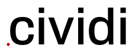
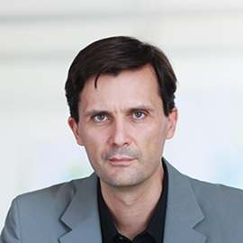
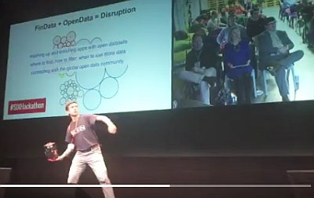
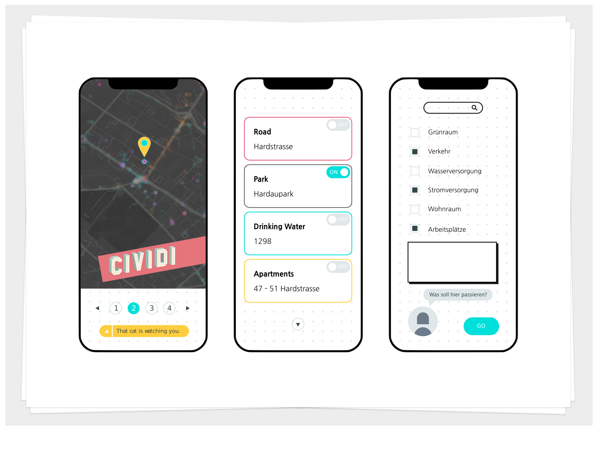
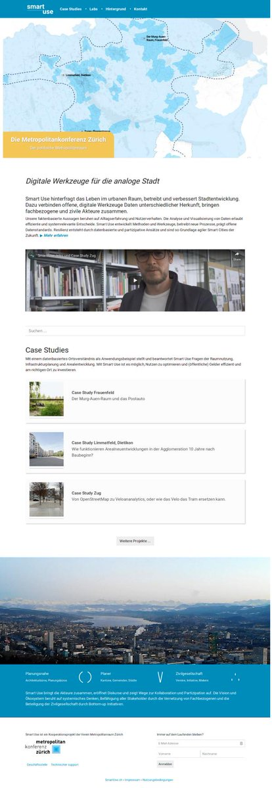

Consensus building with open data
-----------------

_

**Whitepaper** | v1.0 | SmartUse GmbH, June 2019

- [Abstract](#abstract)
- [Who we are](#who-we-are)
- [3x Theses](#theses)
- [Principles](#guiding-principles)
- [Design](#design)
- [Solution](#solution)
- [Architecture](#technology-architecture)
- [Infrastructure](#infrastructure)
- [Roadmap](#roadmap)
- [References](#references)

---

# Abstract

**CIVIDI** is a civic tech startup collaboratively applying data science to new challenges in urban design. Our applications will help you to better understand the city, and for the city to better understand itself.

Just as with other professional services businesses, the connection between those who provide architecture services, and those who purchase it, has transformed: creating demand for a more collaborative and open relationship. From the citizen's perspective there is a heightened sense that their relationship with the urban planning field should be more like their relationships with vendors in other industries: transparent, open, cooperative, actively managed and predictable. These trends are pushing leading firms to realize that, if they want to stay competitive, they must change. This reflects the shifting dynamics of modern city politics, which in the age of e-Government and dropping poll counts, is concerned with ensuring citizen participation through ancillary means. We are here to enable architects, planners, engineers and policymakers to work together with the citizenry through shared insights based on data science, into what truly makes a city tick.

To do this, we are building platforms for organizations to connect to their stakeholders in urban planning, to bring a fresh and transparent approach to negotiations, to build a long lasting connection to customers around shared interests. CIVIDI users are citizens empowered by public data infrastructure, who are willing to consult information sources to form opinions and make better decisions. They are able to verify the due diligence on architectural plans, connect the dots between local street projects and city-scale investments, explore the science behind open data and algorithms, participate in crowdsourcing projects, connect their own software and hardware, and even take part in studies contracted through online markets.

We believe that an ideal environment for imagining neighborhoods of the future, is one where the differences of perspective between the planner, architect, data scientist, civic activist are seen as opportunities instead of as barriers. By eliminating friction in technical components and motivating collaboration between user of diverse skills, we are building bridges that decrease planning deadlock, increase productivity, and bring cost savings.

---

# Who we are

CIVIDI is being launched by a world class, diverse, connected urban science team, backed by founders with extensive backgrounds and wide-ranging network. We hold advanced degrees from leading universities (ETH, Harvard, HSG, Newcastle), deep industry experience, and the maturity to leverage our interdisciplinary mindsets.

### Viktória Molnár

[Email](mailto:viktoria@smartuse.ch) [Xing](https://www.xing.com/profile/Viktoria_Molnar7) LinkedIn

### Thorben Westerhuys

Email GitHub Twitter

### Markus Schaefer

Email LinkedIn

> _"People understand spaces whether they are experts or not."_

### Joris van Wezemael

Email LinkedIn

> _"Maximizing your personal and group potential within the given time and space constraints, instead of meeting arbitrary expectations, makes hackathons well suited to the 21st century knowledge workplace."_

### Oleg Lavrovsky

Email HN IRC XMPP

---

# Theses

There are three basic ideas fundamental this project, which help us to identify key stakeholders and focus our challenges on the longer timescale.

### I. The future of cities is **Responsive**

When diverse sources of information about the urban environment are connected together, non-identifying datasets made into open data resources for civic participation, the foundations are laid for _Smart Use_ of the urban landscape. Factors crucial to critical understanding of the urban landscape, such as finding matches, commonalities and connections between functional areas, have been increasingly made possible with access to the information as structured open data and with the possibilities of machine learning. This leads to _Responsive Cities_, a collaboration of people and models to enable specific, real-time and distributed responses to spatial challenges.

### II. Algorithmic planning needs **Trust models**

Going from a Smart city to a Responsive city means putting more minute-to-minute decisions into the hands of technological processes, which orchestrate algorithms that need to be proven both for their effective and ethical qualities. We have been working on embedding transparency into the analytic process from day one, learning to work with a variety of communication channels to ensure that laypeople - concerned citizens - can understand the system, not only the data scientists and engineers who designed it. We will promote systems that are built to be tamper-proof and explanatory on various levels, investing into a deep foundation for data trust.

### III. Civic Innovation takes **Practice**

Borrowed from the late night engineering culture of pioneering technical campuses in the 60s, the term “hackathon” refers to an intensive collaboration of people working on a project or exploring solutions to a difficult problem within strict time constraints. By organizing urban analytics hackathons we will invite developers to hack on our platform and build their own solutions on top of it.  If our platform works for these kinds of audiences, it will gain viral potential and scale beyond the initial applications while accelerating our open source development model. Practice makes perfect.

---

# Guiding principles

At the launch of any new initiative it is important to state a set of principles clarifying the vision of management. As we are a Civic Tech initiative that strives to provoke and complement developments in the legal and political field, we are acutely aware of the role that governance plays in our idea - and are therefore following closely the developments of new ethical, philosophic and regulatory frameworks around the idea of 'humane' or _responsible_ technology. Details are presented in the following ten guiding principles.

**1/10 Crowd-based**

Our vision for the scope of the project is ambitious, and we cannot hope to achieve these goals within a reasonable time with hired hands alone. We will pursue a crowd-sourced approach at all levels of operations, in research and in development, and aim to grow into an open, distributed organization form in the near future. This means a dedication to ethical foundations and pursuit of inclusion and diversity of opinion above all.

**2/10 Open innovation**

Digital landscapes created with data-sharing technologies are a virtual manifestation of the physical city landscape, helping to create the multiplatform and multilateral social constructs through online networks. Open innovation allows individual users and the public to become the primary source of value within projects, through monetary or creative support. This is the stuff which enables cities to accelerate the evolution of their organizing principles as well as more specific areas of "smart" development.

**3/10 Open stack**

In order to evaluate leading-edge approaches to the technical requirements - and potentially make valuable contributions back to the community we are evaluating and implementing modern software stacks which have achieved a certain maturity level. In this light, our project aims for integration with next-generation data portals, while retaining compatibility with current platforms. We implement the emerging standards of distributed publication, while providing workflows and tutorials for users of monolithic databases. The underlying principle is that of openness in our approach, and leaving a trail of breadcrumbs for others to learn from and build complementary solutions on.

**4/10 Act locally, change globally**

Open source married to the DNA of urban systems design, is bringing its own revolution to the way that architecture is conducted, how cities evolve through a constantly reshaped landscape of human and machine transactions. As open source has revolutionized the way that computer technology is developed, making the Internet as we know it today possible, so urban design evolves to become a field within reach of people around the world, open tools create opportunities to contribute to city planning among the many creative ways we use technology to shape the physical world. Our design decisions reflect the meeting of these worlds.

**5/10 Sustainable interest**

Specific mechanisms to incentivize continued contributions of open source code changes, openly licensed data and open content are prioritized as a pillar of the crowd-based approach. Such systems are often built on utility tokens of value (points or other gamification techniques) to motivate the community to contribute and exchange reusable components (e.g. datasets, dataflows, visualizations). At a next stage, these may be enhanced with tenders and bounties supported by cryptographically traceable records such as Smart Contracts. In any case, we need to think from the beginning about how to make sure that the engine of crowd-sourced innovation is well oiled.

**6/10 Automate spatial analysis**

The use of Geographic Information Systems (GIS) is a foundational area of our platform. Developments in remote sensing, in particular the proliferation of wide-scale, high resolution, and near-time satellite imagery, have led to notable developments in automating the analysis of land use patterns from crop yields to parking lot occupancy. Online marketplaces and data exchanges are already a key instrument to improve and widen the reach of automated spatial analysis (ASA) technology. Few are able to take into account the speed at which Machine Learning and Open Data are advancing the state of the art and apply it in practice, and this is our competitive edge.

**7/10 Enable consumer choice**

As the cost efficiency and reliability of this technology continuing to increase,  will become a feature of all commercial and open source GIS tools. At this point, platforms like ours will clearly be needed to a widening range of users who are seeking improved accessibility and comparability of the outputs of such techniques. We will provide a central point of comparison and strive to establish guidelines and quality metrics into a comprehensive set of criteria for consumers to benefit from. Platform lock-in and technical monopolies are the enemy of progress.

**8/10 Responsible technology**

Our thesis that "Algorithmic planning needs Trust models" is a central tenet of our solution for participative governance, and it needs serious commitment to develop indicators of trust. The idea of *Responsible tech* centers on concerns around the opacity of the processes and algorithms that are put to use in large scale data-driven projects, and proposes instruments for critical analysis, detection and intervention which can be implemented by individual developers or whole communities.

**9/10 We stand on shoulders**

In all of our work we are standing on the shoulders of giants: for example, in the case of Trust models we are relying on the work of visionary projects from the Electronic Frontier Foundation, Open Knowledge International, the Swiss government, prominent scientists, and digital literacy advocates to make sure that the result is a puzzle piece helping to construct a digital society, and not just a digital bazaar.

**10/10 Let us get it right**

Every day we have the opportunity to create something that has the potential to be the ethical compass for someone making a key decision that will influence the development of institutions or neighbourhoods around the world. Our platform for participative governance may play a pivotal role in the way digitally enhanced discussions of urban planning run in 2020 and beyond - if we let it. Efficiency and profitability are a means to an end, not the goal.

---

# Design

Our design is based on following core principles:

### User experience comes first.

Our team has a vested interest, and has already been testing the water over the past year, with a number of approaches to iterating the design and UX that goes into successful information products. A workflow is set up to go from sketches to wireframes to prototypes, and will continue to ensure that investments into technical solutions are backed up by solid design thinking. Partnering with experienced people and local agencies, we will use current methods of design thinking facilitation, A/B testing and focus groups, standard to a user experience engineering practice.

### Design for trust.

The topic of urban growth is contentious, as are new applications for data. Gaining public trust through legal frameworks and advocating for responsible technology is relevant both from a policy standpoint and as an integral part of our design process. This involves foresight activities to anticipate opportunities and challenges, working on legal guidelines and change management with all parts of society, conducting research into the benefits and harms of technologies we introduce, providing clear, understandable information. We see these principles come to life through initiatives like [Better IoT](https://betteriot.wordpress.com/) and [Data trusts](https://theodi.org/article/defining-a-data-trust/), and we wish to be and support other responsible technology projects which develop trust models on the basis of rigorously evaluated formal criteria, created together with inputs from academia, civil society, and practitioners in the field.

### Performance matters.

We will evaluate and decide on the use of a widely accessible mobile-first user experience/user interface frameworks to develop our solution. Our products will be smooth, stable, minimalist, inviting play and experimentation. We aspire to the level of game design and industrial software when it comes to how intuitive and reliable our tools are in the hands of the users. This means bringing the best software and hardware engineering together into a comprehensively designed product.

_Mock-up of an early idea for a mobile app connected to our platform_

---

# Solution

The diagram below shows a high-level view of the platform architecture that is being developed on the basis of the Smart Use cooperation project. Detailed descriptions of some of the core components appear in the following sections.

Continuing to build upon our architectural foundation and working through requirements gathering and team-building phases to determine how the platform will be supported long term will be key to making the right decisions. Here is how we aim to tackle specific technical challenges in the CIVIDI project.

The following sections describe key concepts of our solution architecture, while next chapter (Frameworks) documents more specific platform components.

## Data flows

Many data projects start with a download or scraper which collects data from government publications and other web-sites. The fetched data is then processed and combined, and eventually saved to disk (so that people can download the raw data without hassle), loaded to a relational database (so that analysts can do in-depths queries of the data) and pushed to a key-store value (search engine) which serves applications.

The building blocks that we can use to accomplish this at scale are called dataflows, based on the Data Package Pipelines developed at Open Knowledge. These frameworks allow us to write simple 'pipelines', each consisting of a set of predefined processing steps. Most of the pipelines use of a set of common building-blocks, and some custom processors - mainly custom scrapers for exotic sources.

While we prefer open source environments like Python and open standards like CSV for data aggregation, it is important to us that the sources of data can be as diverse as the tools that we connect to our process. We therefore group these on a project-by-project basis into Factories.

The factory is a core service responsible for running the flows for datasets that are frequently updated and maintained by us at CIVIDI. We are basing this on the [factory](https://github.com/datopian/factory) project at DataHub that uses Datapackage Pipelines, a framework for declarative stream-processing of tabular data, and DataFlows to run the flows through pipelines to process the datasets. We see this as a basic building block for next generation platforms.

In a wider sense, we also see our technical infrastructure grouped around such factories, which are operating on various levels. Initially we will have singular customer engagements, and factories of various sophistication processing data for them. In the future, a factory-of-factories will aggregate the resulting data into the basis for new products and services. Our goal is to co-design an open factory-building process that can be repurposed for various community and 3rd party solutions.

<i><small>Image from <a href="http://okfnlabs.org/blog/2018/08/29/data-factory-data-flows-introduction.html" target="_blank">Data Factory & DataFlows Introduction</a> by Adam Kariv.</small></i>

## Data standards

As our primary basis we wish to build on the efforts to deploy central open data portals around the worlds. Closest to us are those of the Swiss federal government, [opendata.swiss](https://opendata.swiss), the Swiss cantons which are also represented there, the City of Zürich [data.stadt-zuerich.ch](https://data.stadt-zuerich.ch) and other forward-thinking communes. Many of these portals are based on the [CKAN software](https://ckan.org) from Open Knowledge that is the forerunner and important basis for Frictionless Data. Notably, CKAN provides a federated model for data exchange whereby metadata published on local portals can be promoted and consistently represented on regional, national and international portals.

Going beyond federated open data, Frictionless Data builds on the principles of the Web of Data with a set of standards, and a community building tools on a middle ground between centralized/siloed open data and more widely distributed (Linked Data, IPFS, Blockchain or otherwise transmitted) concepts for data exchange. We are inspired by the principles from the [frictionlessdata.io](http://frictionlessdata.io/specs/) project, excerpted here:

1.  **Focused**: We have a sharp focus on one part of the data chain, one specific feature – packaging – and a few specific types of data (e.g. tabular).
2.  **Web Oriented**: We build for the web using formats that are web "native" such as JSON, work naturally with HTTP such as plain text CSVs (which stream).
3.  **Distributed**: we design for a distributed ecosystem with no centralized, single point of failure or dependence.
4.  **Open**: Anyone should be able to freely and openly use and reuse what we build. Our community is open to everyone.
5.  **Existing Software**: Integrate as easily as possible with existing software both by building integrations and designing for direct use – for example we like CSV because everyone has a tool that can access CSV.
6.  **Simple, Lightweight**: Add the minimum, do the least required, keep it simple. For example, use the most basic formats, require only the most essential metadata, data should have nothing extraneous.

From the beginning, the data exchange capabilities of the SmartUse platform are based on standards for metadata exchange such as the [Data Package](http://frictionlessdata.io/specs/data-package/), explained below. We are also already involved in [contributing back](https://frictionlessdata.io/articles/oleg-lavrovsky/) to this community. The main distinguishing features of this approach are:

- containerization formats for any kind of data to enable simple data publication, transport, and consumption.
- platform agnostic interoperability of these data packages with various existing tools
- cutting costs through easier integration and more consistent interpretation of data schema and sourcing

_For a more detailed introduction, visit the Frictionless Data [Field Guide](https://frictionlessdata.io/field-guide/)._

## Geospatial data standards

A Data Package is a simple way of “packaging” up and describing data so that it can be easily shared and used. You can imagine as collection of data and and it's meta-data (datapackage.json), usually covering some concrete topic Eg: "Gold Prices" or "Population Growth Rate In My country" etc. Each Data Package may have zero or more resources and one or more versions.

Last year a [research project](https://research.okfn.org/spatial-data-package-investigation/) took place in the Open Knowledge community into the whether there is a need for a "Spatial Data Package" specification within the Frictionless Data ecosystem - or whether such specification should be a core part of the Data Package schema. The authors concluded that:

*   There is significant friction in the uptake of spatial data by non-GIS-expert users. This problem can be addressed by two adding a small amount of metadata, and some data processing conventions to existing Data Package standards.
*   There is no good solution for a common kind of semi-spatial data, that of tabular data that links to standard boundaries such as administrative or statistical regions. Tabular Data Packages with linked boundary identifiers were proposed.
*   For cases where the above solutions do not meet the package creator's need, including raster data or data that is not under the package creator's direct control, improvements to the emerging Spatial Data Package format were proposed.

We are supporting and implementing these approaches, doing our own evaluations, and hosting regular exchanges with this group and the geographical information systems (GIS) community in general. By exploiting and developing standards like the Data Package, our platform will be compliant with a rapidly growing ecosystem of data manipulation and verification tools, ensuring that data consistency, provenance and quality can be tested and assured through an open choice of channels and with diverse vendors.

## Cloud-ready

Like the DataHub platform that we are inspired by, our project follows a service oriented architecture. It is built from a set of loosely coupled components, each performing distinct functions related to the platform as a whole. We are working on a mix of local datacenter and cloud-based components, but most of our development is focused on online collaboration.

To implement our initial web application, we used the Python Flask microframework and it's REST-compatible [Flask API](https://www.flaskapi.org/), to generate multi-format routes and Web accessible views of our Frictionless Data-compatible API for developers to use. During an earlier phase, we implemented a _Serverless_ architecture coupled to a Node.js environment.

As a next step we are considering a rewrite in the Python based [Django](https://www.djangoproject.com/) framework, with the [Wagtail](https://wagtail.io) administration and [Django REST](http://www.django-rest-framework.org/) library offering comprehensive support for "data model"-based applications, deep integration with advanced database management systems such as PostgreSQL, and a wealth of out-of-box service and backend components to build on.

The initial architecture of the project had to quickly evolve through several development phases, and role-based security in a highly scalable implementation, as well as wider API support and search capabilities, will be supported in the next generation platform.

In the more distant future, our project should be able to move to another framework, another development environment, integrate components from a mix of environments. To this end it is important for us to have flexible and scalable cloud infrastructure. For this reason we are basing our deployment on cloud-scale containerizable technologies like Frictionless Data, Linux and Docker.

## Data science

For work that is more involving, either in terms of the amounts of data involved, or to involve users and tools from various data science disciplines, we have based our data science work in Jupyter notebooks, which enables the output from tools like Julia and Pandas to be combined with Frictionless Data sources in the optimal way.

We started our development process on PostGIS and QGIS, two leading platforms for open source geodata analytics, and are keen to enable support for a wider variety of tools, including ones that are familiar to a wider audience of GIS specialists, empowered and accelerated with modern Data Science platforms that support everything from simple user-driven exploration to Machine Learning approaches.

An example of our approach to popularizing Data Science could be seen through our [presence at Criterion 2019](https://blog.datalets.ch/056/#tangiblecity), where we wanted to put "things" into the hands of visitors that were tangible and even analogue, rather than digital - yet still produced with the kind of spatial analysis and awareness of urban questions that we are working on with Smart Use.

## Integration capabilities

The Frictionless Data standards detailed in previous sections can be complemented by a variety of connectors to breach gaps in the Web of Data. These include support for:

- Linked Data (LD) services which are at the avant-garde of the open data movement, enabling intelligence in applications from Google to Wikipedia.
- Web Mapping Services (WMS) which have made the first generation of online geodata services possible, and are continuing to be a key resource for spatial data projects.
- Open Street Map (OMS), the single largest repository of crowdsourced geodata, and along with it tools and standards for large scale analytics.
- Comprehensive Knowledge Archive Network (CKAN), the most widespread form of open data portal, and host to many thousands of interesting datasets from around the world.

We are currently using the Open Street Map based Mapbox platform to create interactive, high quality renderings of our data science outputs, and we have experimented with a number of other platforms, like OpenLayers, Tangram, Kepler. It is important to us that projects we do are not constrained by a single form of output, that the data could be reinterpreted in diverse ways, not only as 2D maps but also as 3D renderings or tangible objects.

Beyond compatibility with mapping platforms, we need to ensure that programmatic access to our APIs is a gateway to very different uses of our platform. Early experiences with platforms like Open-DAI, Pelias, Geoplatform and Stae have enabled us to consider the implications and challenges of successfully opening up our services to agents and algorithms from third parties.

---

<small>Screenshot of smartuse.ch taken on May 27, 2019</small>

# Roadmap

In our previous joint venture, we built a lightweight framework on which we published a set of spatial stories on the website [smartuse.ch](https://smartuse.ch), in order to explore the hypthosis that wider data sharing is beneficial to city planning commissions, architects, and the general public. Smart Use was developed with on open source geodata analytics in the form of an application and open API built to [Frictionless Data](https://frictionlessdata.io/specs) specifications. The launch of this project in Q2FY19 was the starting point for development of CIVIDI.

This section outlines the main milestones we are committed to in this project, and explains how they are related to the building blocks of our solution which you can find detailed in further chapters.

**2019 Mobilisation**

_"Bringing questions and approaches to the people"._

A stable, functioning, professionally hosted environment and architecture is the next step for launching a Beta platform. Technically, we need to connect a variety data streams, from big spatial data to interfaces to social media, blogs or online news. This means revamping our infrastructure and building our product with enterprise grade components for authentication, automation, search and storage.

This will be a transition and an opportunity to test many of the tools and technologies we will rely on, to build a presence for the company. We need to launch a company website, on whose newsfeed we can show regular signs of life, pointing to online and IRL (events) activities.

Workshops for municipalities, companies or public authorities should address the issues and approaches and an understanding of the possibilities of Open Data in the Planning of open spaces, quarters and areas can be created.

Project work allows specific questions to be investigated for clients. We will start creating the basis for professional services - project pipeline, legal basis, resources - towards the end of the first year.

Current application examples on topics of interest to our community will be published in blogs and eventually in the media.

**2020 Stabilisation**

_"Enabling a longer-term functioning of the platform"._

A payment model will be developed to enable the platform, to allow contributors to participate in the revenues of the platform. This could be done for example via Smart Contracts and blockchain technology.

Accordingly, an institutional format must also be found: an Association, DAO, or Cooperative, that will enable broader ownership and wider participation in the decisions.

A model will be accordingly developed in which users (e.g. of mobile telephony or postal services) are involved in the monetization of their data. This could be done in the form of a partnership or with open source tools.

Client services are further development and regularized with help of a sales and support team.

**2021 Further development**

_"Activating the potential in the evaluation of data"._

Data sources created within the project will be used to generate insights (structural indices) for actual urban development projects. Access to insights will be possible through membership / user licenses or project work. Participants ("cooperative members") would be therefore compensated for their contributions through this model. Our aim is to be referenced in the consensus building efforts of several notable city developments by 2022.

---

# References

Literature list for further reading.

> _The tools currently available to policymakers, legislators, and courts were developed to oversee human decisionmakers and often fail when applied to computers instead. For example, how do you judge the intent of a piece of software? [...] We challenge the dominant position in the legal literature that transparency will solve these problems. Disclosure of source code is often neither necessary (because of alternative techniques from computer science) nor sufficient (because of the issues analyzing code) to demonstrate the fairness of a process._

-- Excerpted from [Accountable Algorithms](https://scholarship.law.upenn.edu/penn_law_review/vol165/iss3/3/) (Joshua A. Kroll et al. 2017)

-- From [Crowdsourcing the Built Environment](https://medium.com/harvard-real-estate-review/crowdsourcing-the-built-environment-382718b99da4) - Harvard Real Estate Review (Wendy W. Fok 2017)
