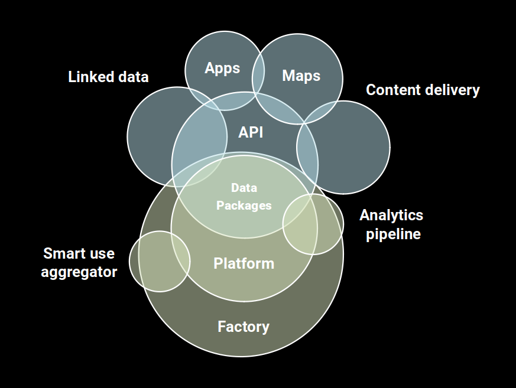

cividi whitepaper
-----------------

# Consensus building by opening data for cities

**cividi** is a civic tech startup applying data science to challenges in urbanism. Our goal is to help you to better understand the city, and for the city to better understand itself. Located in Switzerland, our focus is on supporting participatory planning processes at any scale, building capacity on top of advanced open data infrastructures, and offering our expertise in participatory spatial planning to customers around the world.

product@cividi.ch

https://cividi.ch

v0.11

---

/// contents

- [Abstract](#Abstract)
- [Who we are](#Who-we-are)
- [(Hypo)theses](#Hypotheses)
- [Guiding principles](#Guiding-principles)
- [Design strategy](#Design-strategy)
- [Data architecture](#Data-architecture)
- [Roadmap](#Roadmap)
- [Citations](#Citations)

<style type="text/css">h1 { page-break-before:always }</style>

---

# Abstract

From the citizen's perspective, there is a growing awareness that relationships with the urban planning field should be more transparent, open, cooperative, actively managed and predictable. This is reflected in the dynamics of city planning and politics, concerned with ensuring citizen involvement. Participatory urbanism enables forward-thinking architects, planners, engineers and policymakers to work on data science problems together with the wider citizenry - generating shared insights into what truly makes a city tick, and legitimately addressing many of these core concerns.

To enable this, new platforms are being built for organizations to connect to their stakeholders, bringing a fresh and transparent approach to negotiations, building a sustainable connection to customers around shared interests. Open source and web accessible tools are making it possible to overcome cost and digital literacy barriers. _Urbanists_ are citizens empowered by public data infrastructure, who are willing to consult information sources to form opinions and help to make better decisions about the future of their city.

By eliminating friction in technical components, enabling participation through data exchange, and motivating collaboration, we build bridges that decrease planning deadlock, increase productivity, and bring cost savings. An ideal environment for imagining neighborhoods of the future, is one where the differences of perspective between the planner, architect, data scientist, civic activist are seen as opportunities to urbanise sustainably.

This is what we do, and we are **cividi**.

---

# Who we are

**cividi** is being launched by a world class urban science team, backed by founders with extensive backgrounds and wide-ranging network. We bring deep industry experience (architecture & urban systems, business development, data engineering), hold advanced degrees (ETH, Harvard, HSG, Newcastle), and the maturity to leverage our interdisciplinary mindsets for the success of a civil society initiative.

* Viktória Molnár
* Thorben Westerhuys
* Markus Schaefer
* Joris Van Wezemael
* Oleg Lavrovsky

---

# Context

Our cities are environment, infrastructure, medium and format for our prosperous, culturally rich and comparatively safe lives.

Over many hundreds, even thousands of years of urban development we learned how to organize cities into public and private spaces, build squares, roads, parks and buildings, or install laws, regulations and political processes to make them work. Cities are the spatial syntax for the relationships that make up our culture and economy. We meet in cities to exchange gossip or experiences, to trade ideas or goods. We are linked to our cities with our home or business address that establish our identity and let us conduct our civic and economic lives. At least ideally, spaces, concerns and governance are aligned.

Digitalization introduces entirely new infrastructures, address protocols, algorithmic processes or services to urban spaces, many provided by private entities. The digital is a versatile, adaptable and powerful syntax for relationships. Each relation is computationally addressed and hence trackable. This generates vast amounts of relational data – like stacks of used postal envelopes piling up. Sifting through this data allows for analyzing past choices and predicting future ones. Increasingly data points have not only a time, but also a location stamp. Analyzing them reveals functions and uses in space.

The spatial syntax of cities is largely a public domain. The computational syntax of digital networks is not. We pay for connectivity and convenience by selling our choices – past and future.

Digitalization gives us great power and connectivity. But it also disrupts markets, multiplies identities, questions privacy, challenges sovereignty and splinters the public domain. Spaces, concerns and governance are drifting apart.

## Mission

Historically, those urban cultures seemed to have worked best that balanced top down control and private initiative, that relied on transparency, cooperation and a strong public domain. Today, when the urban age meets the digital, these virtues are to be renegotiated.

Cividi supports a cooperative development of our cities, settlements and landscapes by working towards a digitally enabled public domain. It realigns spaces, concerns and governance.

### Spaces

Cividi organizes data according to a standardized understanding of space, its relations and its dynamics.

### Concerns

Cividi aggregates and visualizes data from heterogeneous sources and allows for the publication of user data and initiatives.

### Governance

Cividi supports participation by establishing access, identity and stake.

---

# (Hypo)theses

Three basic ideas are fundamental to this project, which help us to identify the target audience, and to focus our challenges on the longer timescale.

## I. The future of cities is responsive

Smart cities conceptually are about collecting and managing data, integrating devices, building networks to optimize efficiency of city operations. When diverse sources of information about the city environment are aggregated into open datasets, and tools are made available to connect the datasets in order to generate evidence, the foundations are laid for what we call a _Smart Use_ of the urban landscape.

Adding platforms for civic participation leads to _Responsive Use_ - an interplay of voluntary interventions and algorithmic models to enable specific, real-time and distributed responses to spatial challenges. As Responsive web design helps with open universal access to global knowledge across diverse browser platforms, by supporting the future development of cities in such a way, we are managing complexity and change with the most accessible tools, in service of the most affected people.

## II. Algorithmic planning needs trust models

From pattern detection of satellite photos, to facial recognition and mobile signal triangulation, there is a wealth of tools available to critically understand the city. Visualizing the discrepancies, commonalities and connections between functional areas, for example, is enabled by access to such information as structured open data, allowing statistical reinterpretation and machine learned classification.

Responsive Use puts more minute-to-minute decisions into complicated technological processes which often depend on carefully orchestrated algorithms that need to be proven both for their effective and ethical qualities, whose complexity renders them opaque both to the operator and the affected. Additionally, questions of data ownership and reuse, the rapidly evolving legal conditions for data protection, means that urban systems need to be built to be tamper-proof and explanatory on various levels - with investments into deep foundations for ethical, legal and technical data trust.

## III. People understand spaces, whether experts or not

Urban planning ideas need to quickly reach a wide audience - not only in order to be accepted from a governance perspective, but specifically to have the chance to involve local residents and other stakeholders in the process. Ideas need diverse frames of reference, key arguments in areas of impact to public health, climate change, economic benefit, and stakeholders will tend to focus on frames specific to their context. Embedding transparency into the development process - open access to project reports, to open source tools and data publications, social media and discussion boards - will be a start, but outreach needs to go beyond communication channels alone.

While the urban design field already includes a number of intervention settings for participative design, innovative methodologies like civic tech hackathons (intensive collaborations within strict time constraints) add viral potential and developmental agility. These provide a competitive arena for platforms, help the planners and architects, and enable concerned citizens of all backgrounds to understand and contribute to spatial systems themselves. We are crossing these bridges to go from an expert society that is increasingly overwhelmed by complexity, to scalable urbanism of the people, by the people, for the people.

---

# Guiding principles

We are a Civic Tech initiative that strives to provoke and complement developments in the legal and political field, acutely aware of the role that ethics and governance plays in our idea - and are therefore following closely the developments of philosophic and regulatory frameworks around the idea of 'humane' or responsible technology. Details of our management vision in this regard are presented in the following ten guiding principles.

### 1/10 Crowd-based

Our vision for the scope of the project is ambitious, and we cannot hope to achieve these goals within a reasonable time with hired hands alone. We will pursue a crowd-sourced approach at all levels of operations, in research and in development, and aim to grow into an open, distributed organization form in the near future. This means a dedication to ethical foundations and pursuit of inclusion and diversity of opinion above all.

### 2/10 Open innovation

Digital landscapes created with data-sharing technologies are a virtual manifestation of the physical city landscape, helping to create the multiplatform and multilateral social constructs through online networks. Open innovation allows individual users and the public to become the primary source of value within projects, through monetary or creative support.

### 3/10 Open stack

In order to evaluate leading-edge approaches to the technical requirements - and potentially make valuable contributions back to the community we are evaluating and implementing modern software stacks which have achieved a certain maturity level. In this light, our project aims for integration with next-generation data portals, while retaining compatibility with current platforms. We implement the emerging standards of distributed publication, while providing workflows and tutorials for users of monolithic databases. The underlying principle is that of openness in our approach, and leaving a trail of breadcrumbs for others to learn from and build complementary solutions on.

### 4/10 Act locally, change globally

As open source has revolutionized the way that computer technology is developed and deployed, making the Internet as we know it today possible, so urban design is evolving into a field within reach of people around the world. Open tools create opportunities to contribute to city planning among the many creative ways we use technology to shape the physical world, as cities evolve through a constantly reshaped landscape of human and machine transactions. Our design decisions reflect the meeting of these worlds, and inflect a responsibility to think globally about the potential impact of our tools.

### 5/10 Sustain the interest

Specific mechanisms to incentivize continued contributions of open source code changes, openly licensed data and open content are prioritized as a pillar of the crowd-based approach. Such systems are often built on utility tokens of value (points or other gamification techniques) to motivate the community to contribute and exchange reusable components (e.g. datasets, dataflows, visualizations). At a next stage, these may be enhanced with tenders and bounties supported by cryptographically traceable records such as Smart Contracts. In any case, we need to think from the beginning about how to make sure that the engine of crowd-sourced innovation is well oiled.

### 6/10 Automate spatial analysis

The applied use of Geographic Information Systems (GIS) and Information Modelling (e.g. BIM - Building Information Modeling, UDIM - Urban Design Information Modeling, ...) is a foundational area of our platform. Developments in remote sensing, such as the proliferation of wide-scale, high resolution, and near-time satellite imagery, or low-cost low-power sensors, have led to notable acceleration of capabilities in the analysis of land use patterns from crop yields to parking lot occupancy. Online marketplaces and data exchanges are already a key instrument to improve and widen the reach of automated spatial analysis (ASA) technology. As machine learning and advanced networking advances the state of the art, the ability to republish such data openly for transparent spatial analysis remains a crucial goal.

### 7/10 Enable consumer choice

As the cost efficiency and reliability of this technology continue to increase, connected planning may become a feature of all commercial and open source GIS tools. At this point, platforms like ours will be needed to a widening range of users who are seeking improved accessibility and comparability of the outputs of such techniques. A Data Trust needs to provide a central point of comparison for data platforms, striving to establish guidelines and quality metrics into a comprehensive set of criteria for consumers to benefit from. Platform lock-in and monopolies are a barrier to social progress on the wider scale.

### 8/10 Responsible technology

Our thesis that "Algorithmic planning needs trust models" is a central tenet of our solution for participative governance, which needs serious commitment to develop indicators of trust. The idea of Responsible Tech centers on concerns around the opacity of the processes and algorithms that are put to use in large scale data-driven projects, and proposes instruments for critical analysis, detection and intervention which can be implemented by individual developers or whole communities.

### 9/10 We stand on shoulders

In all of our work we are standing on the shoulders of giants: for example, in the case of Trust models we are relying on the work of visionary projects from the Electronic Frontier Foundation, Open Knowledge International, the Swiss government, prominent scientists, and digital literacy advocates to make sure that the result is a puzzle piece helping to construct a digital society, and not just a digital bazaar.

### 10/10 Let us get it right

Every day we have the opportunity to create something that has the potential to be the ethical compass for someone making a key decision that will influence the development of institutions or neighbourhoods around the world. Our platform for participative governance may play a pivotal role in the way digitally enhanced discussions of urban planning run in 2020 and beyond - if we let it. Efficiency and profitability are a means to an end, not the goal.

---

# Design strategy

Today we should be able to verify due diligence on architectural plans through data, connect the dots between local street projects and city-scale investments, explore the science behind algorithms, participate as citizen urbanists in crowdsourcing, connect our own (open) software and hardware, take part in studies on- and offline. What is lacking is a well designed, central location to discover, engage, and promote this across communities, a good place to share best practices, and shared infrastructure. Our design strategy to overcome these barriers is based on the following core principles.

### User experience comes first /

Our team has a vested interest, and has already been testing the water over the past year, with a number of approaches to iterating the design and UX that goes into successful information products. A workflow is set up to go from sketches to wireframes to prototypes, and will continue to ensure that investments into technical solutions are backed up by solid design thinking. Partnering with experienced people and local agencies, we will use current methods of design thinking facilitation, A/B testing and focus groups, standard to a user experience engineering practice.

### Design for trust //

As the our first Guiding Principle suggests, in providing feedback to communities in terms of data analysis it will be valuable to listen to their constituents, ask questions, give not just data-driven but people-driven insights priority. From a design perspective, this will mean overcoming barriers of trust, formulating questions in terms of personal data, strategizing business model alignment versus the initial reaction to hoard my data.

Gaining user and public trust involves foresight activities to anticipate opportunities and challenges, working on legal guidelines and change management with all parts of society, conducting research into the benefits and harms of technologies we introduce, providing clear, understandable information.

We see these principles come to life through initiatives like [Better IoT](https://betteriot.wordpress.com/) and [Data trusts](https://theodi.org/article/defining-a-data-trust/), and we wish to be and support other responsible technology projects which develop trust models on the basis of rigorously evaluated formal criteria, created together with inputs from academia, civil society, and practitioners in the field.

### Performance matters ///

We will evaluate and decide on the use of a widely accessible mobile-first user experience/user interface frameworks to develop our solution. Our products will be smooth, stable, minimalist, inviting play and experimentation. We aspire to the level of game design and industrial software when it comes to how intuitive and reliable our tools are in the hands of the users. This means bringing the best software and hardware engineering together into a comprehensively designed product.

---

# Data architecture



This diagram shows a high-level view of the platform architecture that is being developed on the basis of the experience of building our first products. Continuing to build upon our architectural foundation and working through requirements gathering and team-building phases to determine how the platform will be supported long term will be key to making the right decisions.  The following sections describe key concepts of our solution architecture, while next chapter (Frameworks) documents more specific platform components.

## Geospatial data standards

We wish to build on top of the efforts to deploy open data portals and create data sharing ecosystems around the world. Closest to us are those of the Swiss federal government - [opendata.swiss](https://opendata.swiss), which also represents the Swiss cantons, various government organizations, and cities such as the [City of Zürich](https://data.stadt-zuerich.ch) and other forward-thinking communes. Many such portals are based on the [CKAN software](https://ckan.org) from Open Knowledge. CKAN provides a federated model for data exchange, whereby metadata published on local portals can be promoted and consistently represented on regional, national and international portals.

Going beyond federated open data, Frictionless Data builds on the principles of the Web of Data with a set of containerization formats for any kind of data to enable simple data publication, transport, and consumption. A community around these standards is building platform agnostic interoperability tools. The frictionless ecosystem is a middle ground between centralized/siloed open data and more widely distributed (Linked Data, IPFS, Blockchain or otherwise transmitted) concepts for data exchange. It prevents great cost benefits through easier integration and more consistent interpretation of data schema and sourcing.

We are inspired by the principles from the [frictionlessdata.io](http://frictionlessdata.io/specs/) project, excerpted here:

- **Focused:** We have a sharp focus on one part of the data chain, one specific feature – packaging – and a few specific types of data (e.g. tabular).
- **Web Oriented:** We build for the web using formats that are web "native" such as JSON, work naturally with HTTP such as plain text CSVs (which stream).
- **Distributed:** we design for a distributed ecosystem with no centralized, single point of failure or dependence.
- **Open:** Anyone should be able to freely and openly use and reuse what we build. Our community is open to everyone.
- **Existing Software:** Integrate as easily as possible with existing software both by building integrations and designing for direct use – for example we like CSV because everyone has a tool that can access CSV.
- **Simple, Lightweight:** Add the minimum, do the least required, keep it simple. For example, use the most basic formats, require only the most essential metadata, data should have nothing extraneous.

A _Data Package_ is a simple way of “packaging” up and describing data so that it can be easily shared and used. You can imagine it as collection of data and it's meta-data (`datapackage.json`), usually covering some concrete topic Eg: "Gold Prices" or "Population Growth Rate In My country" etc. Each Data Package may have zero or more resources and one or more versions.

Last year a [research project](https://research.okfn.org/spatial-data-package-investigation/) led by Steve Bennett took place in the Open Knowledge community into the whether there is a need for a "Spatial Data Package" specification within the Frictionless Data ecosystem - or whether such specification should be a core part of the Data Package schema. The authors concluded that:

1. There is significant friction in the uptake of spatial data by non-GIS-expert users. This problem can be addressed by adding a small amount of metadata, and some data processing conventions to existing Data Package standards.
2. There is no good solution for a common kind of semi-spatial data, like that of tabular data that links to standard boundaries such as administrative or statistical regions. Tabular Data Packages with linked boundary identifiers were proposed.  
3. For cases where the above solutions do not meet the package creator's need, including raster data or data that is not under the package creator's direct control, improvements to the emerging Spatial Data Package format were proposed.

Based on the  basic properties of location, time and relation, new properties can be defined such as movement (a change of location over time), clusters (several locations in close relation) or emergence (the change of relation over time).

Here is an excerpt of the [Traffic Signs in Hansbeke](http://data.okfn.org/data/peterdesmet/traffic-signs-hansbeke) Data Package ([datapackage.json](https://github.com/peterdesmet/traffic-signs-hansbeke/blob/master/datapackage.json)) suggested as an example of a GeoJSON dataset extended with Geospatial metadata:

```jsonld
"name": "traffic-signs-hansbeke",
"title": "Traffic signs of Hansbeke, Nevele, Belgium",
"description": "Geospatial dataset of all traffic signs of Hansbeke, Nevele, Belgium. See https://github.com/peterdesmet/traffic-signs-hansbeke for more information.",
"keywords": [
    "traffic signs", "geospatial", "Hansbeke", "Nevele", "Belgium"
],
"datapackage_version": "1.0-beta.10",
"licenses": [
{
    "type": "cc-zero",
    "url": "http://creativecommons.org/publicdomain/zero/1.0/"
}
],
...
"resources": [
{
    "path": "data/traffic-signs-hansbeke.geojson",
    "name": "traffic-signs-hansbeke",
    "format": "geojson",
    "mediatype": "application/json",
    "schema": { "properties": [
    {
        "name": "id",
        "description": "Record ID.",
        "type": "integer"
    },
    {
        "name": "code",
        "description": "Belgian traffic sign code.",
        "web": "http://wiki.openstreetmap.org/wiki/Road_signs_in_Belgium",
        "type": "string"
    },
    ...
    {
        "name": "facing",
        "description": "Wind direction in which the traffic sign is facing.",
        "type": "string",
        "values": ["N","E","S","W"]
    },
    {
        "name": "verified",
        "description": "True if the existence of the traffic sign has been verified on location.",
        "type": "boolean"
    }
    ...
```

Here you can see a range of properties, simple for a developer to use and extend in easily readable form - which help to understand the dataset, and suggest how a range of helpful and portable indicators could be embedded for rendering and validating the dataset.

We are supporting and implementing these approaches, doing our own evaluations, and hosting regular exchanges with this group and the geographical information systems (GIS) community in general. By exploiting and developing standards like the Data Package, our platform will be compliant with a rapidly growing ecosystem of data manipulation and verification tools, ensuring that data consistency, provenance and quality can be tested and assured through an open choice of channels and with diverse vendors.

The data exchange capabilities of projects previously developed by the team are based on standards for metadata exchange such as the [Data Package](http://frictionlessdata.io/specs/data-package/). We are involved in [contributing back](https://frictionlessdata.io/articles/oleg-lavrovsky/) to these open standards communities. For more details of the above, see the [Frictionless Data Field Guide](https://frictionlessdata.io/field-guide/) and the [Spatial Data Package investigation](https://research.okfn.org/spatial-data-package-investigation/). In addition to this and other examples [at frictionlessdata.io](https://frictionlessdata.io/docs/publish-geo/), visit [datahub.io/loleg](https://datahub.io/loleg/ttn-twist2018-dataset), [schoolofdata-ch](https://github.com/search?q=topic%3Adatapackage+org%3Aschoolofdata-ch&type=Repositories) and [smartuse.ch](https://smartuse.ch) for Data Packages that we have published.

### Data flows

Data processing starts simple. Many data projects begin with a download or scraper, collecting data from government publications and other sites. The fetched data is then processed and combined, and eventually saved to disk (so that people can download the raw data without hassle), loaded to a relational database (so that analysts can do in-depths queries of the data) and pushed to a key-store value (search engine) which serves applications.

The building blocks that we can use to accomplish this at scale are called _DataFlows_, based on the [Data Package Pipelines](https://github.com/frictionlessdata/datapackage-pipelines) from Open Knowledge. These frameworks allow us to write data processing recipes consisting of a set of configurable steps. Most of the pipelines use a set of common building-blocks, and some custom processors - mainly custom scrapers for exotic sources.

While we prefer open source environments like Python and open standards like CSV for data aggregation, it is important to us that the sources of data can be as diverse as the tools that we connect to our process. We therefore group these on a project-by-project basis into _Factories_. The factory is a core service responsible for running the flows for datasets that are frequently updated and maintained. We are basing this on the factory project at [DataHub](https://datahub.io) that uses Datapackage Pipelines, a framework for declarative stream-processing of tabular data, and DataFlows to run the flows through pipelines to process the datasets. We see this as a basic building block for next generation open data platforms.

In a wider sense, we also see our technical infrastructure grouped around such factories, which are operating on various levels. Initially we will have singular customer engagements, and factories of various sophistication processing data for them. In the future, a factory-of-factories will aggregate the resulting data into the basis for new products and services. Our goal is to co-design an open factory-building process that can be repurposed for various community and 3rd party solutions.


_Image from [Data Factory & DataFlows Introduction](http://okfnlabs.org/blog/2018/08/29/data-factory-data-flows-introduction.html) by Adam Kariv_

### Identity

We are planning to implement an enterprise-grade platform for modern identity into the platforms we are building, featuring Single Sign On for users of established identity services - or the customers, partners and employees, on-site deployments, centralized feature management, breached passwords detection, easy to use use tools to manage users, multifactor and passwordless authentication, and machine-to-machine security models for communication between APIs and other trusted services.

Furthermore, as the goal of our project is to understand the city, and for the city to understand itself, a key element in our identity concept is that the city is serving its citizens, and identity is becoming an essential part of the digital infrastructure of a city. Indeed, many civic tech projects rely on identity services provided (or, at least, secured or endorsed) by governments. We are tracking developments in this area, potentially to allow seamless participation for first generation 'digital citizens' on platforms such as [SwissID](https://www.swissid.ch/).

As the question of identity services is closely tied to rights management and thereby digital ownership, a crucial aspect of **cividi** platforms will be the ability to verify users, transfer management and publication rights, provide accreditation and recognize contributions of verified users. In this we are inspired by the [Proof of Stake](https://en.wikipedia.org/wiki/Proof_of_stake) of blockchain systems, although at time of writing we have not decided to technically commit to this approach.

Our civic responsibility here is to inherently support - indeed to participate in shaping - the platforms and best practices of the nation to the greatest extent possible.

### Service architecture

Our project follows a Service Oriented Architecture built from a set of loosely coupled components, each performing distinct functions related to the platform as a whole. We are working on a mix of local datacenter and cloud-based components. Our initial web applications are microservices based on Node.js and Python Flask microframeworks, using components such as the REST-compatible [Flask API](https://www.flaskapi.org/) to generate multi-format routes for Web access as well as an API for developers to use.

The initial architecture of the project had to quickly evolve through several development phases. Group and role-based security, a highly scalable implementation, as well as wider API support and search capabilities, are goals of the next generation platform. We are considering several frameworks for future development which facilitate administration and offer comprehensive support for "data model"-based applications: such as deep integration with advanced database management systems and a wealth of out-of-box service and backend components to build on.

In the more distant future, our project should be able to move to another framework, another development environment, integrate components from a mix of environments. To this end it is important for us to have flexible and scalable cloud infrastructure and focus on standards. For this reason we are basing our deployment on cloud-scale containerization technologies like Frictionless Data, Linux and Docker.

### Cloud infrastructure

Our current production environment is a set of Linux virtual private servers (VPS) nodes, hosted in a Frankfurt datacenter by the UK based [Linode](https://linode.com). On these we run development and production application code, data science projects, deploy experimental and shared software packages. Public cloud-hosted databases are being managed for us securely by [84codes](https://www.84codes.com/), a reliable Swedish tech company. For sensitive data, static deployments and e-mail accounts, we use the services of [METANET](https://metanet.ch) - an established provider in Zürich. Our web-facing components are proxied and accelerated by [CloudFlare](http://cloudflare.com/).

Going forward, we are evaluating various containerization and monitoring platforms, for example to improve the way we use and manage our [Docker](https://docker.com) containers. Next generation data science application are typically built using microservice frameworks and tightly orchestrated deployments with continuous integration. This is particularly key to scaling on-demand services like data acquisition and processing jobs.

### Data science

For work that is more involving, either in terms of the amounts of data involved, or to involve users and tools from various data science disciplines, we have based our data science work in Jupyter notebooks, which enables the output from tools like Julia and Pandas to be combined with Frictionless Data sources in the optimal way.

We started our development process on PostGIS and QGIS, two leading platforms for open source geodata analytics, and are keen to enable support for a wider variety of tools, including ones that are familiar to a wider audience of GIS specialists, empowered and accelerated with modern Data Science platforms that support everything from simple user-driven exploration to Machine Learning approaches.

An example of our approach to popularizing Data Science could be seen through our [presence at Criterion 2019](https://blog.datalets.ch/056/#tangiblecity), where we wanted to put "things" into the hands of visitors that were tangible and even analogue, rather than digital - yet still produced with the kind of spatial analysis and awareness of urban questions.

### Integration capabilities

The Frictionless Data standards detailed in previous sections can be complemented by a variety of connectors to breach gaps in the Web of Data. These include support for some of the following key data sharing ecosystems.

- Linked Data (LD) services which are at the avant-garde of the open data movement, enabling intelligence in applications from Google to Wikipedia.
- Web Mapping Services (WMS) which have made the first generation of online geodata services possible, and are continuing to be a key resource for spatial data projects.
- Open Street Map (OMS), the single largest repository of crowdsourced geodata, and along with it tools and standards for large scale analytics.
- Comprehensive Knowledge Archive Network (CKAN), the most widespread form of open data portal, host to thousands of datasets around the world.

We have evaluated integration with a variety of mapping toolkits including the the OpenStreetMap-based [Mapbox platform](https://mapbox.com), OpenLayers, Tangram, Kepler, etc., to create interactive, high quality renderings of our data science outputs. It is important to us that projects we do are not constrained by a single form of output, that the data could be reinterpreted in diverse ways, not only as 2D maps but also as 3D renderings, simple charts, or even tangible objects.

Beyond compatibility with mapping platforms, we need to ensure that programmatic access to our APIs is a gateway to very different uses of our platform. Early experiences with platforms like Open-DAI, Pelias, Geoplatform and Stae have helped us evaluate the implications and challenges of successfully opening up our services to agents and algorithms from third parties.

---

# Roadmap

This section outlines the main milestones we are committed to in this project, and explains how they are related to the building blocks of our solution which you can find detailed in further chapters.

**2019 Mobilisation**

_"Bringing questions and approaches to the people"._

During the [Smart Use](https://smartuse.ch) project, our team built a lightweight framework on which we published a set of spatial stories in the form of Data Packages, based on open source geodata analytics, and with an open API built to Frictionless Data specifications to be compatible with an emerging ecosystem of tools and processes. The launch of this project in Q2FY19 is the first goalpost for the development of **cividi**.

A stable, functioning, professionally hosted environment and architecture is the next step for launching a Beta platform. Technically, we need to connect a variety data streams, from 'big spatial' data to interfaces to social media, blogs or online news. This means revamping our infrastructure and building our product with enterprise grade components for authentication, automation, search and storage.

This will be a transition and an opportunity to test many of the tools and technologies we will rely on, to build a presence for the company. We need to launch a company website, on whose newsfeed we can show regular signs of life, pointing to online and IRL (events) activities. Current application examples on topics of interest to our community should be published in blogs and eventually in the media.

Workshops for municipalities, companies or public authorities should address the issues and approaches and an understanding of the possibilities of Open Data in the Planning of open spaces, quarters and areas can be created.

Project work allows specific questions to be investigated for clients. We will start creating the basis for professional services - project pipeline, legal basis, resources - towards the end of the first year.

**2020 Stabilisation**

_"Enabling a longer-term functioning of the platform"._

- A payment model must be developed to enable the platform, to allow contributors to participate in the revenues of the platform. This could be done, for example, via Smart Contracts with Blockchain technology.
- Accordingly, an institutional format must also be found for the Data Trust: Association, Cooperative, Collective ... and plans set in motion to align our work with it.
- Accordingly, a model can also be developed in which users (e.g. of mobile telephony or postal services) are involved in the monetization of their data. This could be done in the form of a partnership or with open source tools.
- Client services are further development and regularized with help of a sales and support team.

**2021+ Further development**

_"Activating the potential in the evaluation of data"._

- Data is used to generate structural indices for urbanism work.
- The indices can be marketed via user licenses or project work.
- Participants ("cooperative members") are compensated for their contributions.
- And much, much more!

---

# Citations

> _The tools currently available to policymakers, legislators, and courts were developed to oversee human decisionmakers and often fail when applied to computers instead. For example, how do you judge the intent of a piece of software? [...] We challenge the dominant position in the legal literature that transparency will solve these problems. Disclosure of source code is often neither necessary (because of alternative techniques from computer science) nor sufficient (because of the issues analyzing code) to demonstrate the fairness of a process._
-- [Accountable Algorithms](https://scholarship.law.upenn.edu/penn_law_review/vol165/iss3/3/) (Joshua A. Kroll et al. 2017)

> _By employing new media, developers can expedite project delivery by addressing stakeholder concerns earlier in the process and thereby reduce development costs. With increased attention to conflict mitigation, crowdsourcing could facilitate the creation of a better built environment imagined by developers, designers, and the community._
-- [Crowdsourcing the Built Environment](https://medium.com/harvard-real-estate-review/crowdsourcing-the-built-environment-382718b99da4) - Harvard Real Estate Review (Wendy W. Fok 2017)

> _Building upon the data generated in the Instrumented City and the insights developed in the Smart City, The Responsive City is like an app layer on top of hardware, data, and base services. ... All of this helps support what makes cities great in the first place – engaged citizens of diverse backgrounds sharing a common space in time._
-- [Smart cities are boring. Give us responsive cities](https://techcrunch.com/2017/10/14/smart-cities-are-boring-give-us-responsive-cities/) - TechCrunch (Colin O’Donnell 2017)

> _"Maximizing your personal and group potential within the given time and space constraints, instead of meeting arbitrary expectations, makes hackathons well suited to the 21st century knowledge workplace."_ -- [Has Switzerland been infected by the new “Hackathon Mania”?](https://ict.swisscom.ch/2015/11/has-switzerland-been-infected-by-the-new-hackathon-mania/) - Swisscom (Penny Schiffer 2015)

> _"#partizüri ist die Schnittstelle, welche bestehende Plattformen an einem Ort vereint, Inputs und Ideen aus der Bevölkerung sammelt und Städter*innen informiert, involviert und vernetzt. #partizüri ist nun der zentrale Briefkasten für alle Inputs."_ -- [#partizüri – Eine für alle(s)](https://www.urban-equipe.ch/post/partizueri-eine-fuer-alles) - Urban Equipe blog

> _"You don't want to be equal, you want to be fair...about rebalancing interests."_ -- Paul-Olivier Dehaye

> _"[Urban planning and public health] both aim to improve human well-being, emphasize needs assessment and service delivery, manage complex social systems, focus at the population level, and rely on community-based participatory methods. Both fields focus on the needs of vulnerable populations."_ -- Kochtitzky CS, et al. [Urban planning and public health at CDC](https://europepmc.org/abstract/med/17183243). MMWR Suppl. 2006 Dec;55(2) 34-38. PMID: 17183243
