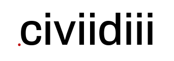

Consensus building with city data
-----------------

**Whitepaper** | SmartUse GmbH, February 2019

# Abstract

The heart of the SmartUse project is creating a rich, up-to-date, high quality data for urban planning purposes. When different data sources are connected, the datasets are cleaned, normalized, validated, combined and analyzed, we aim to create the most extensive repository of responsive city data in Switzerland.

Our data is collected in manual and automated ways from authoritative public sources, standardized to allow it to be queried, analyzed, and combined with other data. Factors crucial to critical understanding of the urban landscape, such as finding matches, commonalities and connections between functional areas, are made possible with access to the information as structured data.

We believe that an ideal analytics environment for city planning is one where the differences of perspective between the architect, data scientist, civic activist are no longer a deciding factor in determining the outcome of projects. By eliminating friction in technical components and motivating collaboration between user of diverse skills, our platform increases productivity and brings cost benefits.

Civiidiii users are not only website visitors who consult the information, but are able to do their own analysis, find connections between local neighbourhoods and influential city projects, and run data-mining algorithms themselves - or collaborate with groups to whom this work is contracted through our marketplace.

## Team

A world class, diverse, connected urban science team headed by a smart project manager and savvy data scientist, backed by three founders with extensive backgrounds and network.

Viktoria

Thorben

Markus

Joris

Oleg

# Theses

We are working on three theses relevant to the technical architecture of this project, which help us to identify key stakeholders and challenges on the longer roadmap.

### Big Architecture is facing Big Changes

Just as with other professional services businesses, the connection between those who provide a service and those who purchase it has transformed, creating demand for a more collaborative and open relationship. From the customer’s perspective there is a heightened sense that their relationship with their urban planning firms should be more like their relationships with other vendors: transparent, open, cooperative, actively managed and predictable.

These trends are pushing leading architecture firms to realize that, if they want to stay competitive, they must change. This reflects the shifting dynamics of modern city politics, which in the age of eGovernment and dropping poll counts, is concerned with ensuring citizen participation through ancillary means. Our overarching goal is to enable the architects, planners, engineers and policymakers to work together with the citizenry through shared insights into the data of what makes a city tick.

### Civic Innovation takes Practice

Borrowed from the late night engineering culture of pioneering technical campuses in the 60s, the term “hackathon” is a blend of the words “hack” and “marathon,” and refers to an intensive collaboration of people working on a project or exploring solutions to a difficult problem within strict time constraints (usually 24 or 48 hours).

Encouraged by the ideas, outcomes and learning opportunities that have come out of hackathons, we are putting it to the test in this project by organizing an urban analytics hackathon in early 2020 to invite developers to hack on our platform. In the meantime we are actively supporting and participating in a variety of external hackathons to get early exposure to the community. If our platform works for these kinds of events and audiences, we believe it will have a chance to have viral potential and scale beyond the initial applications while accelerating our development.

### Algorithmic planning needs Trust models

Going from a smart city to a responsive city means putting more minute-to-minute decisions into the hands of technological processes, which orchestrate algorithms that need to be proven both for their effective and ethical qualities. We have been working on embedding transparency into the analytical process from day one, learning to work with a variety of communication channels to let not only data scientists and engineers understand the system, but to be able to respond to the question of "are you building a black box?" with evidence of how our system is both tamper-proof and self-explainable on a variety of levels.

In all of our work we are standing on the shoulders of giants, but in this case in particular we are relying on the work of visionary projects from the Electronic Frontier Foundation, Open Knowledge International, the Swiss government, prominent scientists, and digital literacy advocates to make sure that the result is a puzzle piece helping to construct a digital society, and not just a digital bazaar.

# Design

Our design is based on following core principles:

- User experience comes first.
- Performance matters.
- We build on open standards.

## Developing the design

Our team has a vested interested and has already been testing the water over the past year with a number of approaches to iterating the design and UX that goes into successful information products. We have a basic workflow set up to go from sketches to wireframes to prototypes, and will continue to ensure that investments into technical solutions are backed up by solid design reasoning.

Partnering with experienced people and local agencies, we will use current methods of design thinking facilitation, A/B testing and focus groups, standard to a user experience engineering practice. We will evaluate and decide on the use of a widely accessible user experience/user interface framework such as [Material Design](https://material.io/) to develop our solution.

# Incentives

The system will built upon an incentive-driven economy.

# Solution

The following chapters present an outlook on the technical architecture being developed on the basis of the SmartUse project.

## Software architecture

Open source technology is in the DNA of this project. It has revolutionized the way that technology is developed, and made the Internet as we know it possible. In civiidiii, open source is married to the DNA of urban systems design, that is bringing it's own revolution to the way that architecture is conducted, how cities evolve through a constantly reshaped landscape of human and machine transactions. Our _software_ architecture reflects the meeting of these worlds.

The initial architecture of the project had to quickly evolve through several development phases. The only constant was the web-facing user interface. It was not a priority for the alpha release to have role-based security or highly scalable implementation: these will be the goals of future phases as the project becomes operational. We are focusing on data publication standards in the next phase, APIs and search capabilities will follow soon after.

Like the DataHub platform that we are inspired by, our project follows a service oriented architecture. It is built from a set of loosely coupled components, each performing distinct functions related to the platform as a whole.

At civiidiii, the data-sharing and data-technology landscape is seen as a virtual manifestation of the physical city landscape, and we intend to develop and deliver software as expressive and scalable as it will need to be to work with the multiplatform and multilateral smart city of the future.

## Data aggregation

In order to get that data, we have an extensive set of downloaders and scrapers which get the data from government publications and other web-sites. The fetched data is then processed and combined, and eventually saved to disk (so that people can download the raw data without hassle), loaded to a relational database (so that analysts can do in-depths queries of the data) and pushed to a key-store value (search engine) which serves our main website (cividi.ch).

The building blocks that we are using to accomplish all of this are called dataflows, based on the Data Package Pipelines developed at Open Knowledge. These frameworks allow us to write simple 'pipelines', each consisting of a set of predefined processing steps. Most of the pipelines use of a set of common building-blocks, and some custom processors - mainly custom scrapers for exotic sources.

## Data portals

Despite wishing to include "exotic sources" as mentioned in the previous section, as our primary basis we wish to build on the efforts to deploy central open data portals of the Swiss federal government, [opendata.swiss](https://opendata.swiss), and that of the City of Zürich, [data.stadt-zuerich.ch](https://data.stadt-zuerich.ch) - and evaluated the [CKAN software](https://ckan.org) that they both implement.

Nevertheless, we chose to use a newer technology stack for the project, in order to evaluate leading-edge approaches to the technical requirements - and potentially make valuable contributions back to the community. In this light, our project aims for integration with next-generation open data portals, such as the new [datahub.io](https://datahub.io) site, while retaining compatibility with current platforms like CKAN. It implements the emerging and upcoming standards of Frictionless Data.

## Frictionless

The data exchange capabilities of the SmartUse platform are based on the [Frictionless Data Standards](https://frictionlessdata.io/specs/) for metadata exchange, in the development of which our tech lead has [been involved](https://frictionlessdata.io/articles/oleg-lavrovsky/). For an introduction, visit the [Field Guide](https://frictionlessdata.io/field-guide/). The main distinguishing features of this approach are:

- containerization formats for any kind of data to enable simple data publication, transport, and consumption.
- platform agnostic interoperability of these data packages with various existing tools
- cutting costs through easier integration and more consistent interpretation of data schema and sourcing

## Data Packages

A Data Package is a simple way of “packaging” up and describing data so that it can be easily shared and used. You can imagine as collection of data and and it's meta-data (datapackage.json), usually covering some concrete topic Eg: "Gold Prices" or "Population Growth Rate In My country" etc. Each Data Package may have zero or more resources and one or more versions.

By exploiting and developing standards like the Data Package, our platform will be compliant with a rapidly growing ecosystem of data manipulation and verification tools, ensuring that data consistency, provenance and quality can be tested and assured through an open choice of channels and with diverse vendors.

## Factories

The [factory](https://github.com/datopian/factory) is a core service responsible for running the flows for datasets that are frequently updated and maintained by Datahub. This is a project that uses Datapackage Pipelines, a framework for declarative stream-processing of tabular data, and DataFlows as described above to run the flows through pipelines to process the datasets. We see this is a basic building block for the next generation of our platform.

In a wider sense, we also see our technical infrastructure grouped around such factories, which are operating on various levels. Initially we will have singular customer engagements, and factories of various sophistication processing data for them. In the future, a factory-of-factories will aggregate the resulting data into the basis for new products and services. Our goal is to co-design an open factory-building process that can be repurposed for various community and 3rd party solutions.

# Frameworks

To implement our initial, REST-compliant architecture, we used [Flask API](https://www.flaskapi.org/), which generates multi-format routes and Web accessible views of our API similar to [Django REST](http://www.django-rest-framework.org/) for developers to use.

In the future, this project could potentially move completely to another framework, e.g. [Django](https://www.djangoproject.com/). Continuing to build upon our architectural foundation and working through requirements gathering and team-building phases to determine how the platform will be supported long term will be key to making the right decisions here.

Compared to Flask, Django offers a deep integration with relational database management systems such as PostgreSQL. It provides better support for an agile development process, requiring frequent changes in the database model. Although Flask is a great option for a quick web application, in particular as a web frontend for a python script, it lacks proper support and clean integration of data migrations. Nevertheless, Flask offers database integation with low effort when using third party libraries such as SQLAlchemy. But if relational databases comes into full play together with an agile development process, the effort maintaining migrations etc. with Flash massively increases. Here, Django plays its role from the beginning. It offers a comprehensive support of "data model"-based  applications backed with a relational database by its mighty ORM (object-relational-mapping). It provides a deep integration with most relational database management systems such as e.g. PostgreSQL.

# Infrastructure
