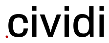

# Cividi whitepaper

**The intrinsic city viewer**

SmartUse GmbH, February 2019

## Abstract

This whitepaper presents an outlook on the technical platform being developed on the basis of the SmartUse project.

...

This whitepaper demonstrates an analytical environment where the differences of perspective between the architect, data scientist, civic activist are no longer a deciding factor in determining the outcome of planning projects. By harnessing a solution which eliminates friction between technical components and user skills, the users of Cividi will be in a unique position to increase productivity and cost benefits.

### SmartUse GmbH: a world class urban science team

### Big Architecture is facing Big Changes

> Just as with other professional services businesses, the connection between those who provide a service and those who purchase it has transformed, creating demand for a more collaborative and open relationship. From the customer’s perspective there is a heightened sense that their relationship with their urban planning firms should be more like their relationships with other vendors: transparent, open, cooperative, actively managed and predictable.

These trends are pushing leading architecture firms to realize that, if they want to stay competitive, they must change. This reflects the shifting dynamics of modern city politics, which in the age of eGovernment and dropping poll counts, is concerned with ensuring citizen participation through ancillary means. Our overarching goal is to enable the architects, planners, engineers and policymakers to work together with the citizenry through shared insights into the data of what makes a city tick.

### Putting innovation into Practice

Borrowed from the late night engineering culture of pioneering technical campuses in the 60s, the term “hackathon” is a blend of the words “hack” and “marathon,” and refers to an intensive collaboration of people working on a project or exploring solutions to a difficult problem within strict time constraints (usually 24 or 48 hours).

Encouraged by the ideas, outcomes and learning opportunities that have come out of hackathons, we are putting it to the test in this project by organizing an urban analytics hackathon in early 2020 to invite developers to hack on our platform. In the meantime we are actively supporting and participating in a variety of external hackathons to give early exposure to the community, and accelerate our development.
